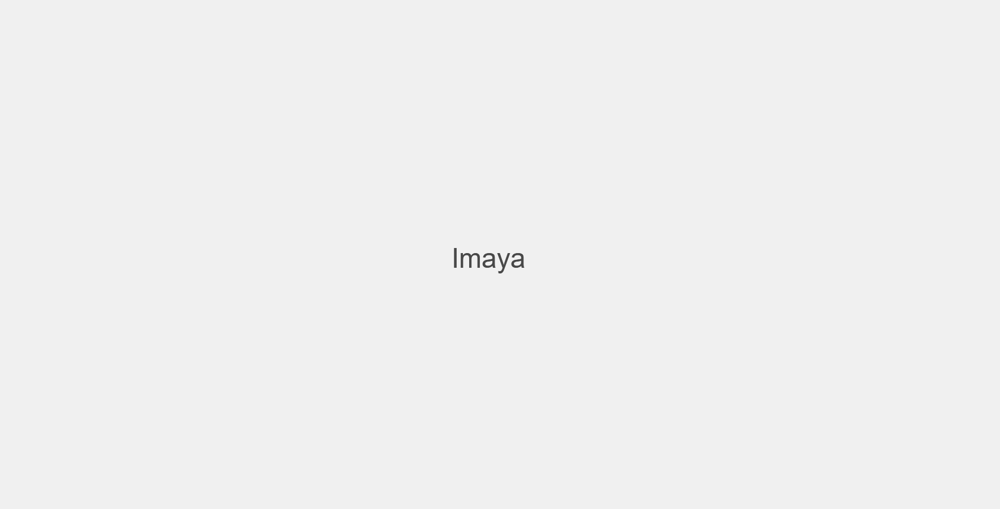

[](https://github.com/gongahkia/imaya/releases/tag/1.0.0) 
[](https://github.com/gongahkia/imaya/releases/tag/2.0.0) 
[](https://github.com/gongahkia/imaya/releases/tag/3.0.0) 
  
> [!IMPORTANT]  
> Please read through [this disclaimer](#disclaimer) before using [Imaya](https://github.com/gongahkia/imaya).

# `Imaya` 🫗

What will you do 今や?

## Rationale

[I am my own greatest enemy](https://i.imgflip.com/3fahyh.png) when it comes to using [task management apps](https://www.reddit.com/r/productivity/comments/1au1uzj/whats_considered_the_best_app_for_taskproject/).  

More than once, I have found myself [anxious](https://www.reddit.com/r/ADHD_Programmers/comments/xa7hll/do_any_of_you_feel_overwhelmed_by_productivity/) after opening that day's to-do list, just to discover [46 things](https://preview.redd.it/a604rad7j4651.png?auto=webp&s=63112b65e516d3e19dcbd05489d09967a2d73dce) scheduled for completion.  

*(Just to be clear, this is not in any way the fault of those apps. This is mostly a result of poor time management.)*

It became clear to me that what I needed was a tool that let me [cut through the noise](https://preview.redd.it/80gsl73buxld1.png?auto=webp&s=939fed7c6043148153dde311683defce1f568287) and choose which tasks to prioritise. 

With those considerations in mind, I created [Imaya](https://github.com/gongahkia/imaya).


## Screenshot

Imaya has changed greatly over its past iterations.  

It currently looks like [this](#v3).

### V1





### V2


### V3


## Usage

> [!TIP]  
> See [here](#get-started) to get started quickly.  

### Overview

In Imaya, tasks are sorted categorised into [3 pools](#pools) of water.

Imaya limits you to choosing 1 task from each sized [pool](#pools) everyday, for a total of 3 tasks. Aim to complete all [3 pools](#pools) by the end of the day.

Plan the order in which you complete tasks by checking out Imaya's reccomended [flows](#flows).

### Pools

#### 💧 Stream

Streams represent **small tasks** that are generally gentle and manageable for an easy win.

They could be an administrative task or personal time for your mental wellbeing.

#### 🏞 River

Rivers represent **medium** tasks that require a moderate amount of energy and focus, but not all of your attention.

This translates to secondary assignments or tasks with light problem-solving.

#### 🌊 Ocean

Oceans represent **large** tasks that demand deep focus.

This means tasks that call for as little distraction as possible, including meetings and primary assignments.

### Flows

#### 🐸 Eat that frog 

*Eat that frog* is taken from [Brian Tracey's book of the same name](https://www.briantracy.com/blog/time-management/the-truth-about-frogs/?srsltid=AfmBOorL_u1oLNVS80Ait_zgS9oCp8MXX8nHKl-RjJsG4vp4EBfqtz6Z).

Start with the [LARGE task](#-ocean), then the [MEDIUM task](#-river), then the [SMALL task](#-stream).

#### 🗻 Climb the summit 

*Climb the summit* provides a balanced approach to your day.

Start with the [MEDIUM task](#-river), then the [LARGE task](#-ocean), then the [SMALL task](#-stream).

#### 🏃🏼 Slow burn 
        
*Slow burn* is the perfect flow for those who prefer a slower start to their day.

Start with the [SMALL task](#-stream), then the [MEDIUM task](#-river), then the [LARGE task](#-ocean).

### Get started

Our favourite way to use Imaya *(and what we recommend you do)* is extract the 3 most pressing tasks from your to-do list each morning, and slot them into Imaya.

*Avoid [to-do list fatigue](https://www.reddit.com/r/productivity/comments/1bmjltj/big_todo_list_low_energy_levels_what_to_do/).* You are able to schedule up to 9 tasks every day, but Imaya restricts you from suffering from the [ill effects of overambition](https://www.reddit.com/r/Journaling/comments/1e5r7fc/how_to_get_over_disappointments_about_tasks_not/).

*Start every week on a fresh slate.* You are able to check the tasks you have completed for the current week, but Imaya will forget them once the week is over. 

| Task type | Focus level | Time | Context | Example |
|------|-------|---------|---------|---------|
| Stream (small) | Light, habitual | 15-30 minutes | Administrative or wellbeing | Clear emails, yoga session, file documents |
| River (medium)| Balanced, analytical | 45-60 minutes | Project-orientated, incoming, process-based | Email campaign, schedule social media, finish presentation |
| Ocean (large) | Creative, intense | 90+ minutes | Deliverable-oriented | Write report, edit video, project deliverable |

## Installation

Current instructions involve running `Imaya` locally.

```console
$ git clone https://github.com/gongahkia/imaya && npm install
$ npm run dev
```

Then visit [`http://localhost:3000`](`http://localhost:3000`).

## FAQ

### What other [names](#reference) were being considered aside from [Imaya](https://github.com/gongahkia/imaya)?

* 水 *(mizu*) meaning water
* 今 *(ima*) meaning now
* 茶 *(ocha)* meaning tea
* 平静 *(heiwa)* meaning calm
* 歩 *(ho*) meaning step
* 進む *(susumu*) meaning move on
* 現在 *(genzai)* meaning present

### Is [Imaya](https://github.com/gongahkia/imaya) meant to replace my to-do list app?

* No. Imaya is a companion app meant to assist your to-do list. Think of Imaya as a daily priority list that enables you to narrow down your to-do list backlog.

### I regularly have sudden urgent tasks that need my attention. How can I embed urgent work?

* We recommend leaving your medium task empty if you experience regular, sudden waves of incoming workload. 

### What do I do after I've completed my core 3 tasks?

* Wahoo! Good work. Imaya's goal is to help you feel accomplished with your day. Each time you complete a task pool, you'll learn about your limits and what best fits your workflow, so if you notice yourself completing pools often, feel free to increase the density of the task inside them for better results.

## Disclaimer

### General Information

The information provided by [Imaya](https://github.com/gongahkia/imaya) ("the Application") is for general informational purposes only. All information within the Application is provided in good faith; however, we make no representation or warranty of any kind, express or implied, regarding the accuracy, adequacy, validity, reliability, availability, or completeness of any information within the Application.

**Use of the Application is at your own risk.**

### No Professional Advice

The Application does not provide any form of professional advice, including but not limited to legal, medical, financial, or psychological advice. The Application is designed as a **productivity companion tool** and should not be used as a substitute for professional judgment. If you require professional advice, consult a qualified professional in the relevant field.

### Limitation of Liability

Under no circumstances shall the developers, contributors, or maintainers of Imaya (collectively referred to as "we," "us," or "our") be held liable for any direct, indirect, incidental, special, consequential, or exemplary damages arising out of the use of or inability to use the Application. This includes, but is not limited to, loss of data, productivity, or profits, even if advised of the possibility of such damages.

### Third-Party Content

The Application may contain links to third-party websites, services, or content that are not affiliated with or controlled by us. We are not responsible for the content, accuracy, or practices of these third-party entities and do not endorse them. Accessing third-party resources is at your own discretion and risk.

### No Warranty

The Application is provided "AS IS" and "AS AVAILABLE" without any warranty of any kind, express or implied, including but not limited to the implied warranties of merchantability, fitness for a particular purpose, or non-infringement. We do not guarantee that the Application will be uninterrupted, error-free, or free of harmful components, including viruses.

### User Responsibility

You are solely responsible for your use of the Application and its features. It is your responsibility to ensure that your use of the Application complies with all applicable laws, regulations, and guidelines. 

The Application’s task management features, including task scheduling, reminders, and notifications, are provided to assist users with personal organization. However, we cannot guarantee that the features will operate without error across all platforms, including mobile, desktop, and web. Users are advised to maintain backups of critical task information independently.

### Updates and Modifications

We reserve the right to update, modify, or discontinue the Application at any time without prior notice. We are not obligated to provide support, maintenance, or updates for the Application.

### Indemnification

By using the Application, you agree to indemnify and hold harmless the developers, contributors, and maintainers from and against any claims, damages, losses, liabilities, costs, or expenses (including reasonable legal fees) arising from your use of the Application or violation of this Disclaimer.

### Governing Law

This Disclaimer is governed by and construed in accordance with the laws of [Insert Jurisdiction]. Any disputes arising from or in connection with this Disclaimer shall be subject to the exclusive jurisdiction of the courts of [Insert Jurisdiction].

### Changes to This Disclaimer

We reserve the right to update or revise this Disclaimer at any time. Any changes will be effective immediately upon posting the revised version within the Application or on our official repository. Continued use of the Application after changes are made constitutes your acceptance of the revised Disclaimer.

### Platform-Specific Considerations

#### Mobile

The Application is available on mobile platforms for Android and iOS devices. While we strive for seamless integration and performance, certain features may depend on device compatibility, operating system updates, or third-party services, which are outside our control.

#### Desktop

For desktop users, the Application is optimized for modern web browsers. We recommend using the latest versions of browsers such as Chrome, Firefox, Safari, or Edge for the best experience. Compatibility with older browser versions is not guaranteed.

#### Web

The web version of the Application is accessible through a browser and relies on stable internet connectivity for full functionality. Performance may vary depending on your network conditions and device capabilities.

## Reference

The name `Imaya` (今や) is [Romaji](https://japanese.fandom.com/wiki/Romaji), often understood to mean "now" in [Kanji](https://japanese.fandom.com/wiki/Kanji). 

However, 今や *(imaya)* differs from the more commonly used 今 *(ima)*. While 今 *(ima)* is generally used to refer to the current moment in various contexts, 今や *(imaya)* specifically highlights the contrast between the past and the present, emphasizing the significance of the here and now against the backdrop of transformation from a prior condition. 


