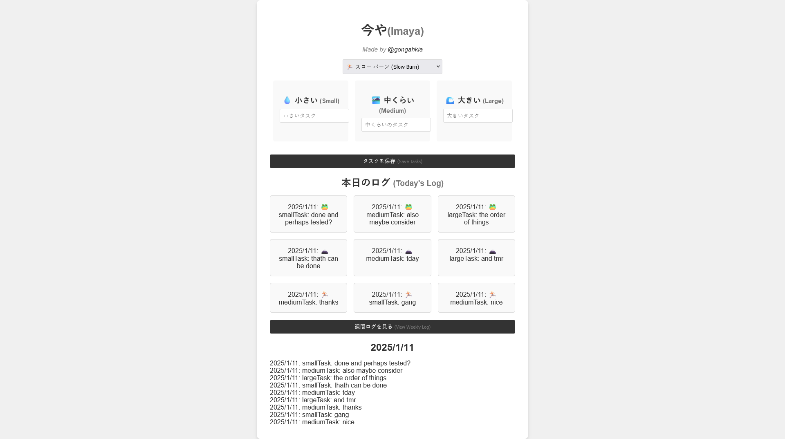

# Imaya v1

> [!WARNING]
> Now deprecated.

## Usage

```console
$ cd src
$ make
```

## Implemented

* Vanilla HTML, CSS and JS
* Animated `index.html` that transitioned to `home.html`
* Daily view and Weekly log somewhat implemented
* Data stored to [localStorage API](https://developer.mozilla.org/en-US/docs/Web/API/Web_Storage_API)

## Issues

* Flows not integrated into the workflow at all
* Unable to edit tasks after creation
* Unable to reorder tasks 
* Web version not ported to Ionic or any mobile framework

## Screenshot


